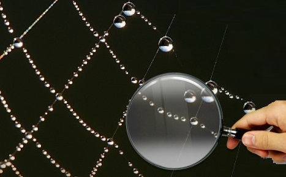

			

				
			
			

 			

				<h1 class="text-center"> <b>Semantic Web Lab</b></h1>
				<h3 class="text-center">Department of Maths and Computer Science</h3>
				<h4 class="text-center">University of Cagliari</h4>
			

The [Semantic Web Lab](http://webofcode.org/lab/) is mainly devoted to the design, analysis and experimentation of algorithms and systems involving Big structured and unstructured Data for the Web, such as knowledge graphs, massive textual data, web and source code repositories.
Our effort is particularly focused on automating or simplifying access to these resources with innovative query systems, such as Question Answering over Linked Data, Machine Reading, SPARQL extensions and our By-Example Structured Query approach.

Members
------

### Current

 - [Maurizio Atzori](http://swlab.unica.it/atzori) - Lead Researcher
 - [Diego Reforgiato](http://swlab.unica.it/reforgiato) - Faculty Research Fellow
 - Andrea Dessi - PhD Student (supervised by Maurizio Atzori)
 - Livio Pompianu - PhD Student (co-supervised by Maurizio Atzori)
 - Amna Dridi - PhD Student (supervised by Diego Reforgiato)
 - Danilo Dessì - PhD Student (supervised by Diego Reforgiato)
 - Emanuele Mameli - Research Assistant
 - Mattia Atzeni - Intern, Student (LM)
 - Federica Muceli - Intern, Student (LM)
 - Flavia Murru - Intern, Student (LM)
 - Daniele S. Ferru - Student (LM)
 - Andrea Medda - Student (LM)
 
  

  

  
### Alumni

 - Riccardo Angius - Student
 - Andrea Maxia - Student
 - Gabriele Rota - Student
 - Stefano Serra - Student
 - Simone Barbieri - Research Assistant
 - Mattia Setzu - Intern
 - Annalisa Congiu - Intern
 - Julia Schmidt - Student (LM18)

Projects
--------
In the following the list of some projects currently undertaken by our lab.

 - [swipeQA]() Exploiting Structured Queries in Question Answering and Search. In collaboration with Prof. Carlo Zaniolo (UCLA), awarded by a [Google Faculty Research Award](http://googleresearch.blogspot.com/2015/02/google-faculty-research-awards-winter.html).
 - [SWiPE](http://atzori.webofcode.org/projects/swipe) Searching Wikipedia by Example, a user-friendly interface for structured queries
 - [Security Horizons](http://atzori.webofcode.org/projects/http://tcs.unica.it/projects/security-horizons) A consortium of universities working on security and privacy issues (PRIN 2010-11 project)
 - [wfn](wfn) Web of Functions, executable functions spread around the Web
 - [SPARQL4coding](http://atzori.webofcode.org/projects/SPARQL4coding) Massive dataset of Source code repositories that can be queried with SPARQL
 - [rankProperties](http://atzori.webofcode.org/projects/rankProperties) a machine-learning approach to sort RDF properties on the fly
 - [runSPARQL](http://atzori.webofcode.org/projects/runSPARQL) Recursion and SPARQL macros within SPARQL engines
 - [woraSPARQL](http://atzori.webofcode.org/projects/woraSPARQL) Write-One Run-Anywhere SPARQL Custom Functions plugin for OpenLink Virtuoso
 - [QA3 (QAcube)](http://qa3.link) Question Answering over Statistical Linked Data. Awarded at the [QALD-6 Task3 Challenge](http://qald.sebastianwalter.org/index.php?x=challenge&q=6), with a 2nd place in its category. 
 
Previous projects:

 - [DENIS]() 
DENIS: Dataspaces Enhancing the Next Internet in Sardinia (RAS)
 - [U-DID]()
PI of project Unstructured Data Integration for Dataspaces (RAS)
 - [DIVA](http://kdd.isti.cnr.it/project/diva)
A predictive system aimed at fighting against tax evasion in VAT domain
 - [KDubiq](http://www.kdubiq.org/kdubiq/control/research_areas#wg5)
Ubiquitous Knowledge Discovery (WG5: Privacy and Security)
 - [GeoPKDD](http://www.geopkdd.eu/)
Geographic Privacy-aware Knowledge Discovery and Delivery
 - [GeoPKDD.it](http://geopkdd.di.unipi.it/)
Italian Project on Geographic Privacy-aware Knowledge Discovery and Delivery (MIUR COFIN2004)
 - [P3D - Privacy Preserving Pattern Discovery](http://www-kdd.isti.cnr.it/p3d/)
A "Curiosity Driven and Independent Research" ISTI Internal Project
 - [KDDML-MQL](http://kdd.di.unipi.it/kddml/)
Knowledge Discovery in Databases Markup Language
 - [ClickWorld]()
Data analysis of Click Streams

